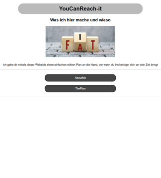
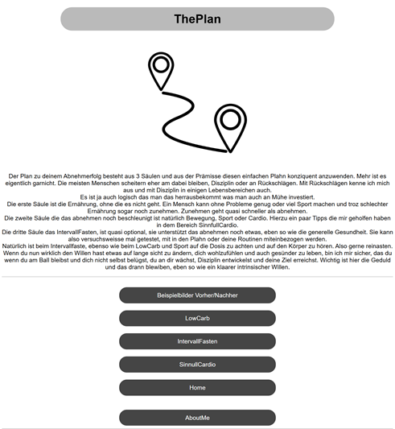
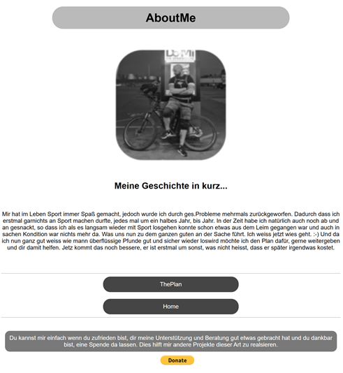

# YouCanReach-it

> **Erste Gehversuche** – ein persönliches Lern‑ und Übungsprojekt

## Idee & Motivation

**YouCanReach-it** ist eines meiner ersten eigenen Webprojekte. Ziel war es, eine **einfache, klare Website** umzusetzen und dabei grundlegende Web‑Techniken praktisch zu üben – von Struktur über Styling bis zur Veröffentlichung mit **GitHub Pages**.

Inhaltlich geht es um Motivation, persönliche Erfahrungen und einen einfachen, alltagstauglichen Plan rund um Bewegung, Ernährung und Durchhaltevermögen.

---

## Projektüberblick

Die Website besteht aus mehreren statischen HTML‑Seiten mit gemeinsamem CSS:

* **Landing Page** – Einstieg & Motivation
* **AboutMe** – persönliche Geschichte in Kurzform
* **ThePlan** – Erklärung des einfachen Plans
* Weitere Unterseiten (z. B. LowCarb, Intervallfasten, Cardio)

---

## Ordnerstruktur

```plaintext
├── image/                # Allgemeine Bilder
├── screenshots/          # Vollständige Seiten-Screenshots
│   ├── abou_me.png
│   ├── landing.png
│   └── plahn.png
├── thumbnails/           # Kleine Vorschaubilder
│   ├── abou_me.png
│   ├── landing.png
│   └── plahn.png
├── index.html            # Startseite
├── aboutme.html          # Über mich
├── plan.html             # Der Plan
├── lowcarb.html
├── intervall.html
├── sinncardio.html
├── picsside.html
├── main.css              # Zentrales Stylesheet
└── README.md
```

---
## Screenshots 
*Klicke auf ein Vorschaubild (Thumbnail), um den vollständigen Screenshot zu sehen.* 
<table> 
  <tr> 
    <td align="center"> 
      <a href="screenshots/landing.png"> 
         
      </a>
      <br /> 
      <strong>Landing Page</strong> 
    </td> 
    <td align="center"> 
      <a href="screenshots/plahn.png"> 
         
      </a>
      <br /> 
      <strong>The Plan</strong> </td> 
    <td align="center"> 
      <a href="screenshots/abou_me.png"> 
         
      </a>
      <br /> 
      <strong>About Me</strong> 
    </td> 
  </tr>
  <tr>
     <td align="center"> 
      <a href="screenshots/low.png"> 
         
      </a>
      <br /> 
      <strong>LowCarb</strong> 
    </td> 
     <td align="center"> 
      <a href="screenshots/intervall.png"> 
         
      </a>
      <br /> 
      <strong>About Me</strong> 
    </td> 
  </tr>
</table>
---

## Technik

* **HTML5**
* **CSS3**
* **GitHub Pages** für das Hosting

Keine Frameworks – bewusst **pures HTML/CSS**, um die Grundlagen zu lernen.

---

## Status

✅ Funktionsfähig

🔧 Lernprojekt – Code & Struktur spiegeln meine **ersten Gehversuche** in der Webentwicklung wider und werden nach und nach verbessert.

---

## Ausblick

* Struktur & Semantik weiter verbessern
* Responsive Design ausbauen
* Inhalte sprachlich & visuell verfeinern

---

## Hinweis

Dieses Projekt dient primär **Lern- und Demonstrationszwecken** und erhebt keinen Anspruch auf medizinische oder sportwissenschaftliche Beratung.

---

💡 *Feedback & Verbesserungsvorschläge sind willkommen!*
